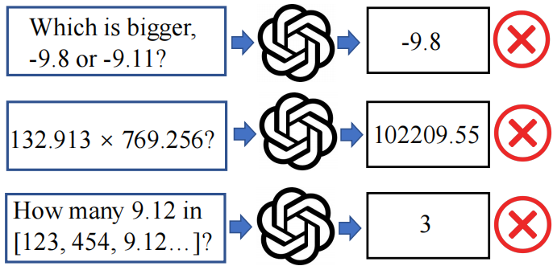

# Exposing Numeracy Gaps: A Benchmark to Evaluate Fundamental Numerical Abilities in Large Language Models

<p align="center">
    📖 <a href="https://arxiv.org/abs/2502.11075" target="_blank">NumericBench Pper</a> • 🤗 <a href="https://huggingface.co/datasets/TreeAILab/NumericBench" target="_blank">NumericBench Dataset</a>
</p>

### Introduction

<p align="center">
  
</p>

**NumericBench** is a comprehensive benchmark designed to evaluate the numerical reasoning capabilities of Large Language Models, addressing their limitations in tasks like arithmetic, number recognition, contextual retrieval, comparison, summarization, and logical reasoning. By incorporating diverse datasets ranging from synthetic number lists to real-world domains like stock trends and weather patterns, NumericBench systematically tests LLMs in both structured and noisy contexts. Experiments on models such as GPT-4o and DeepSeek-V3 reveal significant weaknesses, emphasizing the need for numerically-aware modeling to enhance LLMs' real-world applicability.

### Experiment Result


### Citation

```
@misc{li2025exposingnumeracygapsbenchmark,
      title={Exposing Numeracy Gaps: A Benchmark to Evaluate Fundamental Numerical Abilities in Large Language Models}, 
      author={Haoyang Li and Xuejia Chen and Zhanchao XU and Darian Li and Nicole Hu and Fei Teng and Yiming Li and Luyu Qiu and Chen Jason Zhang and Qing Li and Lei Chen},
      year={2025},
      eprint={2502.11075},
      archivePrefix={arXiv},
      primaryClass={cs.CL},
      url={https://arxiv.org/abs/2502.11075}, 
}
```
